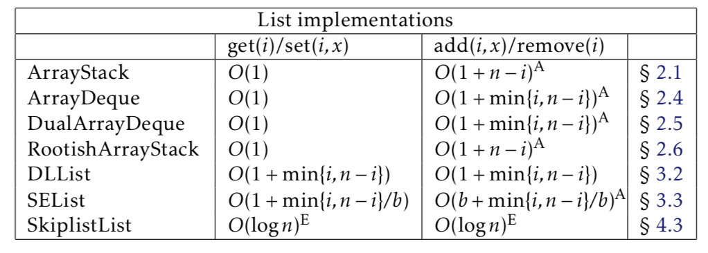
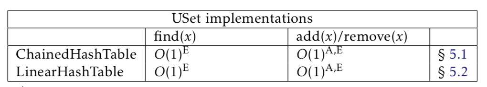
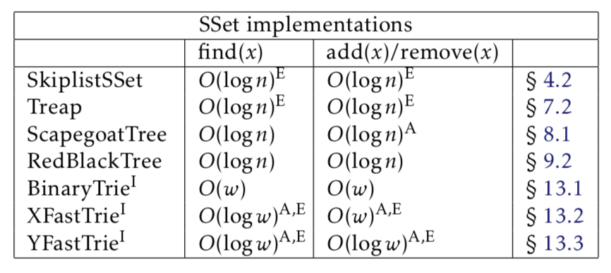
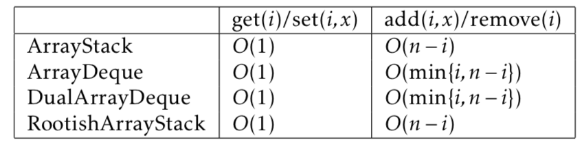
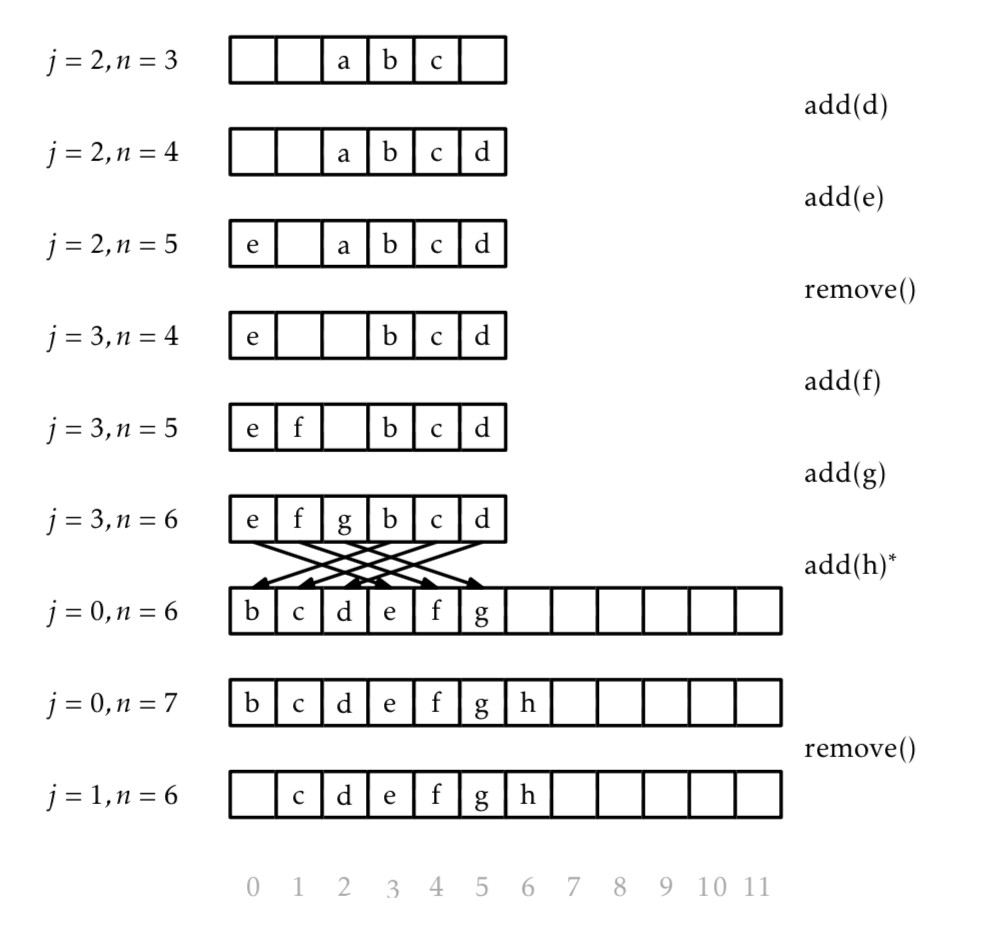
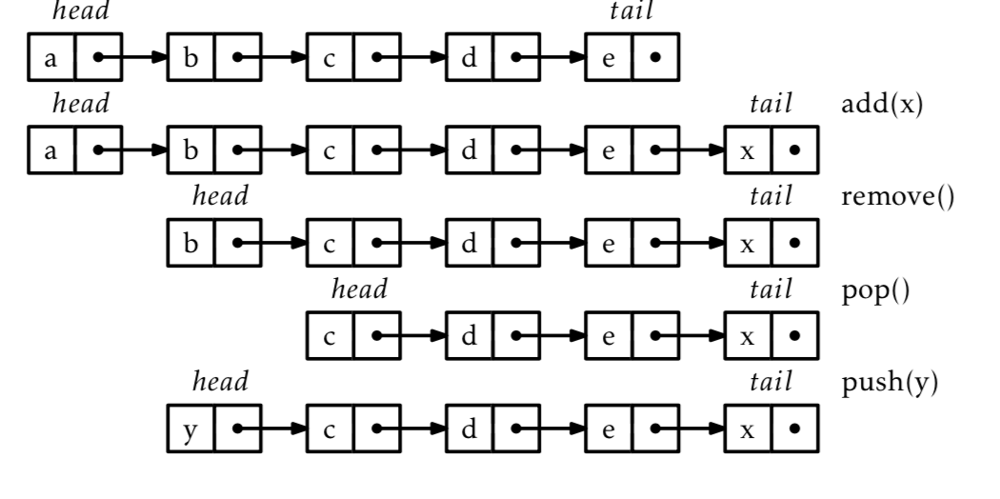
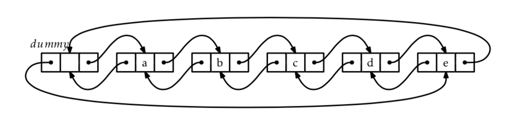
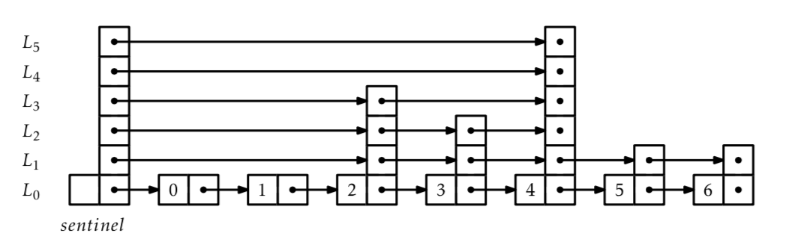

# Data Structures - Part 1 (Lists)

The goal is to get a decent overview of ata structures and algorithms before diving deep into the machine learning curriclium. Here are the resources I'm using:
- Microsoft's [free course](https://classroom.udacity.com/courses/ud513) 
- [Textbook](https://opendatastructures.org/) by Pat Morin on Data Structures

## Introduction

From the textbook:

*Number of operations: Imagine an application with a moderately-sized data set, say of one million (106), items. It is reasonable, in most appli- cations, to assume that the application will want to look up each item at least once. This means we can expect to do at least one million (106) searches in this data. If each of these 106 searches inspects each of the 106 items, this gives a total of 106 × 106 = 1012 (one thousand billion) inspections.*

*Processor speeds: At the time of writing, even a very fast desktop computer can not do more than one billion (109) operations per second. This means that this application will take at least 1012/109 = 1000 seconds, or roughly 16 minutes and 40 seconds. Sixteen minutes is an eon in computer time, but a person might be willing to put up with it (if he or she were headed out for a coffee break).*

When studying the performance of a data structure, there are three things that matter most:
1. Correctness: The data structure should correctly implement its interface.
2. Time complexity: The running times of operations on the data structure should be as small as possible.
3. Space complexity: The data structure should use as little memory as possible.

### Efficiency (complexity)

BigO notation is the way programmers and computer scientists discuss efficiency. It's written with an `O` followed by an algebraic expression that explains how the algorithm scales with increased data. Essentially, for a complex equation for runtime, the element in the equation which domainates as x goes to infinity is the result when talking about BigO.

Ex: `5nlog(n)+8n−200` runs in `nlog(n)` time 

- Big Ω: the best-case scenario. The Big Ω of an algorithm describes how quickly an algorithm can run under the best of circumstances.
- Big O: the worst-case scenario. Typically, we are most concerned with the Big O time because we are interested in how slowly a given algorithm will run, at worst. How do we essentially make the ‘worst-case’ not as bad as it could be?
- Big θ: this can only be used to describe the run-time of an algorithm if the Big Ω and the Big O are the same. That is, the algorithm’s run time is the same in both the best and worst cases.


### Common Data Interfaces

The **Interface** describes the set of interactions you can have with the data structure (add, remove, etc.). The **Implementation** is how the data structure is actually constructed, and the same interface can be implemented in many different ways.

The queue, stack and deck are different examples of data structure arrays with different rules for adding and removing values from the array. In this book, he focuses on the **list** to represent linear sequences, since it's a more general form of all of these. Operations allowed on the list:
1. Size: return length of list
2. Get(i): return the ith vaule
3. Set(i, x): set item i in the list to the value x
4. Add/Remove(i, x): add/remove value x at position i



The **Unordered Set** contains n distinct elements; no element appears more than once; the elements are in no specific order. The **Ordered Set** is similar, but keeps the elements in the set sorted for easy searching.

*The distinction between the USet and SSet find(x) operations is very important and often missed. The extra functionality provided by an SSet usually comes with a price that includes both a larger running time and a higher implementation complexity. For example, most of the SSet implementations discussed in this book all have find(x) operations with run- ning times that are logarithmic in the size of the set. On the other hand, the implementation of a USet as a ChainedHashTable in Chapter 5 has a find(x) operation that runs in constant expected time. When choosing which of these structures to use, one should always use a USet unless the extra functionality offered by an SSet is truly needed.*





## Array Lists

Summary of the structures talked about in this chapter



Data structures that store values in an array have some advantages and disadvantages in common:
- Arrays offer constant time access to any value in the array
- Arrays are not dynamic. Adding or removing an element near the middle of a list means that a large number of elements in the array need to be shifted to make room for the newly added element.
- Arrays cannot expand or shrink. *When the number of elements in the data structure exceeds the size of the backing array, a new array must be created.*
 
### ArrayStack

An array stack is an implementation of the list interface. It uses a large array a (larger than the number of values in the list). You also need a value n to keep track of the number of elements actually in a.

Initialize:
```python
a = []
n = 0
```

Accessing and modifying the elements of an ArrayStack using get(i) and set(i,x) is trivial.

```python 
def get(i, a):

	return a[i]

def set(i, x, a)

	y = a[i] #save and return the old value of a[i]
	a[i] = x
	return y
```

Resizing is a little more complicated. To implement the add(i,x) operation, we first check if a is already full. If so, we call the method resize() to increase the size of a. With this out of the way, we now shift the elements a[i], . . . , a[n − 1] right by one position to make room for x, set a[i] equal to x, and increment n. remove(i,x) is the same idea, except we only resize if a is getting way smaller than n to save memory.

If we ignore the cost of the potential call to resize(), then the cost of the add(i, x) operation is proportional to the number of elements we have to shift to make room for x. Therefore the cost of this operation (ignoring the cost of resizing a) is O(n − i).

```python
def add(i, x):
	if n = length(a): 
		resize() 
	a[i+1,i+2,...,n] = a[i,i+1,...,n−1] #shift up everything to the right of i
	a[i] = x
	n = n+1
```

### ArrayQueue

This is a first-in-first-out (FIFO) queue. An ArrayStack would be a poor way to implement this. Since you need to use both ends of the list, one of the two operations must work on the head of the list, which involves calling add(i,x) or remove(i) with a value of i = 0. This gives a running time proportional to O(n).

The trick for this is to use modular arithmetic to simulate a circular array. (modular arithmetic is what we use for time: 15:00 % 12:00 = 3:00). The image does a good job showing how this works. Use j to store where the next value to remove is and use n to keep track of the length of the array. These operations go at `O(1)`

```python
def init():
	a = []
	n = 0
	j = 0

def add(x):

	if n+1 > len(a):
		resize()

	n = n + 1

	a[(j+n)%a] = x #puts x at the end of the circle

def remove():

	x = a[j]

	j = (j++ % a) #move down the array, or wrap back if at the end

	n = n - 1

	if length(a) ≥ (3*n): 
		resize() 

	return x
```



### ArrayDeck

An extension of the ArrayQueue that allows you to add and remove at both ends. Essentially, it keeps the idea of the circular array. Each time you add or remove an item, you figure out if there are more values to the left or to the right of the item. Based on that, you add the item and shift over the values on whichever side had less. This gives add(x, i) and remove(i) complexity of `O(1+min([i,n-i]))`.

### Other arrays

You can also make an ArrayDeck by combining two ArrayStacks, one for the front end of the deck and one for the back end.

## Linked Lists

These data structures are also implementations of the list interface. They use pointer-based structures rather than arrays. 

Advantages over array implementations:
- more dynamic, can add or delete a node in constant time, no matter where you are on the list
Disadvantages:
- lose the ability to get(i) or set(x,i) in constant time, since we have to follow the links

### Singly-Linked Lists

Basically, every element in the list is a **node** or a tuple of size 2. The first element in the node is the value, and the last element is a pointer to the next node. A head and tail variable are used to keep track of the first and last node.



To use a linked list for a stack, it's pretty straightforward. Just push(x) / pop(x) to the head of the sequence. These run at `O(1)` time.

```python
def push(x):

	u = (x, old_head)
	head = u

	if n == 0:
		tail = u

	n = n + 1

def pop():

	if n == 0:
		return None

	x = head.value()

	head = head.next()

	n = n - 1
```

FIFO queues are also easy to implement here. Instead of pushing to the front of the list, the add(x) function just adds a node to the end of the list. pop(x) stays the same, removing the value from the front.


```python

def add(x):

	u = new_node(x)

	tail.next() = u

	tail = u 
```

### Doubly-Linked Lists

If you want to implement a Deque with the singly-linked list, the only issue is removing the tail from the list. This requires traversing the whole list to assign the new tail after you remove the old value. The other problem are the edge cases - removing the last element or adding the first element of the list.

To solve this problem, doubly linked lists add a value to each node, so now there's node.next() and node.prev().

There's also a dummy node that doesn't contain any value, but acts as a placeholder so there are no special node. It precedes the first node and is after the last node, making the structure circular.



Since you always have to start at the dummy node, then either traverse forward or backwards to retrieve a value from the list (whichever is shortest), this operation runs a `O(1+min([i, n-i]).`

Adding a value is also `O(1+min([i, n-i])`, since this just requires finding the ith node, then updating the next() and prev() values for the relevant nodes.

### Space Efficient Linked Lists

You can also save space by using linked blocks, where multiple values are stored together in the node.

## Skiplists

Essentially, this is just a series of singly-linked lists. Each list that makes up the skip list contains a random subset of all the elements. This lets you make big jumps to get to the item of interest.

All implementations (get(i), add(i,x), remove(i)) run at `O(log(n)`.




