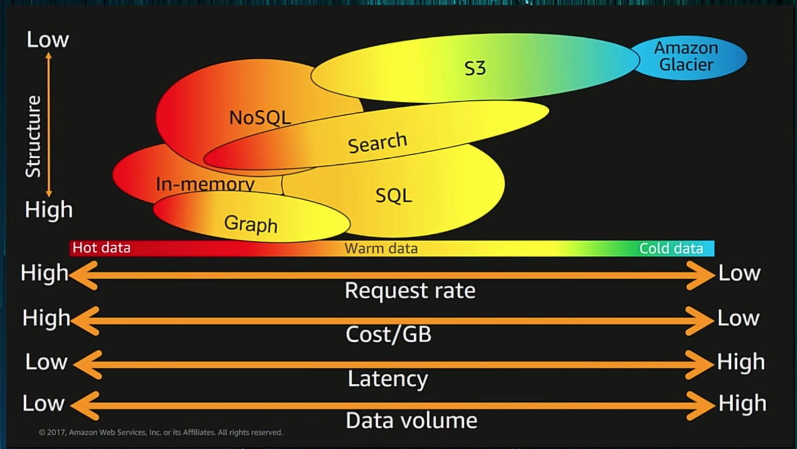
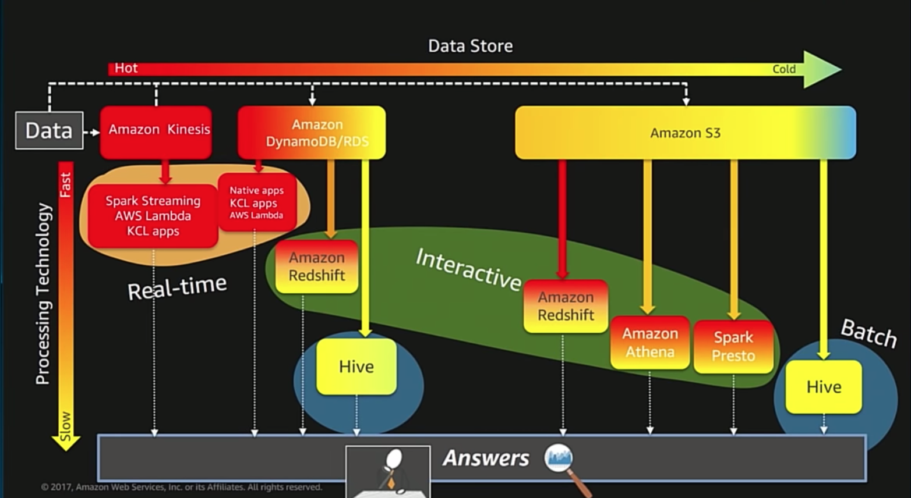

# AWS Best Practices and Architectures

[Source](https://www.youtube.com/watch?time_continue=163&v=a3713oGB6Zk): AWS Re:invent

## Big Data Evolution

- 150TB of data per day is common for today's applications, especially with video and audio
- Changing from batch processing to stream processing
- Stream processing is being combined with AI for real-time predictions
- Cloud services evolving from VMs to managed services to serverless
  - DynamoDB, NoSQL
- Amazon services are being built to enable the integration of common AI tools

## Architectural Principles

- Decouple your ML pipeline
  - Separate data storage from processing and analysis
- Use the right tool for the job, specialized for the job
- Leverage managed and serverless services
- Use log-centric design patterns, immutable logs
- Be cost conscious, if it's cheaper, it usually means it's optimized for that application by AWS
- Plan for your systems to be integrated with AI in the future

### Big Data Pipelines

Collect Data --> Store --> Process --> Consume --> Answers

Storage and processing is an iterative cycle.

- Hot data: small, frequent access
- Warm
- Cold data: Huge, not accessed (backup, glacier)

Types of Data
- Data structures (databases)
- Files (video, image, audio, logs)
- Streaming data (from devices, sensors)

Storage
- Data Structures --> memory / (no)SQL
- Files --> File store (HDFS, S3)
- Streams -->  Stream storage

Stream storage
- Apache Kafka
- Amazon Kinesis (AWS)
- Amazon Kinesis Firehose (AWS)
  - Managed data delivery
  - Also transports the data to S3
- Decouples devices and consumers
- Allows the combination of multiple streams
- Streaming MapReduce

### Data storage

**File Data**
- Use Amazon S3
- Natively supports Spark
- Decouples storage and compute
- Can run transient clusters to interact with data

**What structure should I use?**
- Fixed schema: SQL/NoSQL
- Schema-free (JSON): NoSQL, search
- Key/Value: In-memory/NoSQL
- Graph: GraphDB

## Data Analytics

AmazonAI
- Pre-made services for NLP and image recognition
- Managed ML platforms
- AWS Deep Learning AMI

