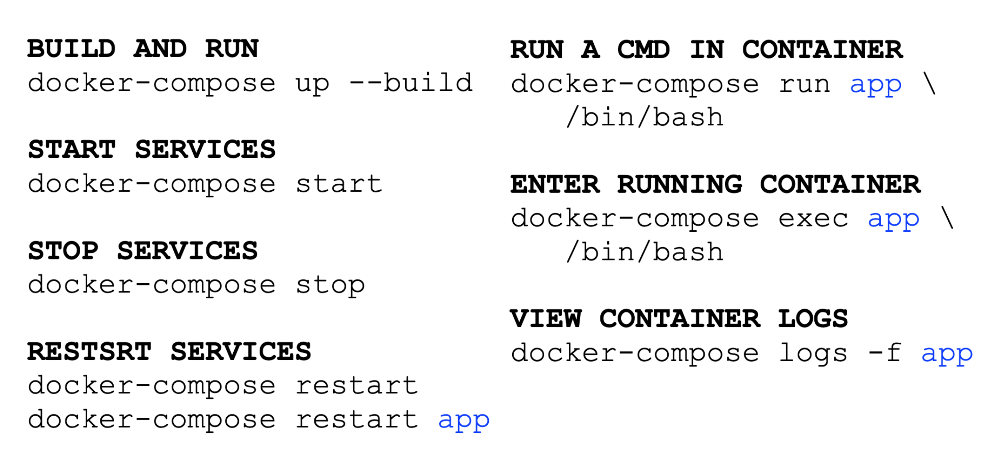

ComplementaryComplimentary# Docker for Data Science

From a presentation at PyCon 2018.
- [Lecture Video](https://www.youtube.com/watch?v=jbb1dbFaovg)
- [Github Repo](https://github.com/docker-for-data-science/docker-for-data-science-tutorial)
- [Slides](https://docs.google.com/presentation/d/11y8C-5u35_7--IUPuI4i4Xqiy-FUcR1GAERdJg692c8/edit#slide=id.g3950aa8d3c_0_57)

## 1. Docker Essentials

- Jupyter notebooks
  - Are awesome for data science for many reasons including reproducibility and readability
  - Downside is that they only run on your local machine


- Docker
  - Docker allows us to package and run applications in an isolated environment
  - Anoalogy is a shipping container.
  - Each container includes:
    - Code
    - Dependancies
    - Data
  - Key differences from VMs:
    - Shares the same kernel as the host
    - More lightweight and better performance
  - Docker Hub contains lots of public images
  - An image is a frozen snapshot of a container
  - OOP as an analogy for Docker:
    - Images : Classes
    - Layers : Inheritance
    - Containers : Objects


### Exercise A: Pull Image from Docker Hub

> [DockerHub](https://hub.docker.com) is a public [registry](https://docs.docker.com/registry/) where you can find and download Docker images. This is where you will find official Docker images for Linux distributions, databases, and Python.

1. We will start by pulling an image from DockerHub to our local machine using the [`docker pull`](https://docs.docker.com/engine/reference/commandline/pull/) command. We will use this image for the rest of tutorial:

```command
$ docker pull python:3.6.5-alpine3.7
```

**Tip:** `docker pull` defaults to DockerHub. Can also pull from a [different registry](https://docs.docker.com/engine/reference/commandline/pull/#pull-from-a-different-registry).*

2. We can take a look at all images on our machine using the [`docker images`](https://docs.docker.com/engine/reference/commandline/images/) command:

```console
REPOSITORY                                TAG                 IMAGE ID            CREATED             SIZE
python                                    3.6.5-alpine3.7     27e79c0fa4d2        13 days ago         87.4MB
```

**Tip:** Check out [Project Jupyter on DockerHub](https://hub.docker.com/r/jupyterhub) for lots of great pre-built Docker images!*

### Exercise B: Create Container

> We can create containers from an image. Think of images like a cookiecutter.

1. Taking a look at the [Dockerfile](https://github.com/docker-library/python/blob/b99b66406ebe728fb4da64548066ad0be6582e08/3.6/alpine3.7/Dockerfile) for the image we pulled, it will run `python3` when a container is created.

```command
$ docker run -it python:3.6.5-alpine3.7
Python 3.6.5 (default, Apr  4 2018, 23:11:43)
[GCC 6.4.0] on linux
Type "help", "copyright", "credits" or "license" for more information.
>>>
```

**Tip:** `docker run` has lots of [options](https://docs.docker.com/engine/reference/commandline/run/#options)*

2. We are at the Python shell prompt inside of the container. Use `Ctrl + P + Q` to detach from the container and return to your prompt.

### Exercise C: Stop Container

> Detaching from the container means it is still running in the background.

1. We can take a look at all running container using the [`docker ps`](https://docs.docker.com/engine/reference/commandline/ps) command:

```console
CONTAINER ID        IMAGE                    COMMAND             CREATED             STATUS              PORTS               NAMES
8d5d1420dd97        python:3.6.5-alpine3.7   "python3"           20 minutes ago      Up 20 minutes                           quirky_rosalind
```

**Tip:** Use `docker ps -a` to view all stopped containers. Containers stop when the process we are running inside of the container is exited (or killed).*

2. Use [`docker stop`](https://docs.docker.com/engine/reference/commandline/stop) with your container name to stop the container.

```console
$ docker stop quirky_rosalind
quirky_rosalind
```

**Tip:** We can use either the [container-name] or [container-id] to refer to containers.*

3. Confirm this container has stopped using `docker ps -a`.

### Exercise D: Delete Container

1. We can delete stopped container using the `docker rm` command:

```console
$ docker rm quirky_rosalind
quirky_rosalind
```

2. Confirm this container is not listed when we do a `docker ps -a`.

### Exercise E: Shell into container

> In Exercise 2, we created a container which ran the `python3` shell after it launched. This default command was set in the `Dockerfile` of the image we pulled.

1. We can override the default container launch command by passing in parameters when we create a container using [`docker run`](https://docs.docker.com/engine/reference/commandline/run):

```console
$ docker run -it python:3.6.5-alpine3.7 /bin/sh
/ #
```

We are now inside the shell of the container.

**Tip:** If your image contains the bash shell, you can get to that prompt using `/bin/bash`*

**Tip:** Alpine is a lightweight Docker image with no frills*

## 2. Dockerfile Essentials

- How do you create new images?
  - `docker commit` freezes the container
  - Can also write a dockerfile (preferred), containing all commands used to assemble the images
- Commands
  - FROM - sets base image
  - LABEL - adds metadata to image
  - COPY - copies files / directories into image
  - ENV - sets environment variable
  - WORKDIR - sets working directory
  - RUN - executes shell commands in a new layer
    - Best to reduce the number of layers, so chain multiple commands with the `&&`
  - ENTRYPOINT - configures container to run as executable
  - CMD - provides default for executing container


- Copying data in and out of containers. Data disappears when we delete a container
  - `docker cp` to copy files in/out of containers
  - Mount a local folder to the inside of the container
    - `docker run -v /full/local/path:/mounted_dir`
    - Best Practice: Add VOLUME command to Dockerfile
  - Setup port forwarding to connect to containers
    - `$ docker run -p 9999:8888`
    - Best Practice: Add EXPOSE command to Dockerfile
```
# Make port 8888 available to outside world
EXPOSE 8888
```

- Dockerfile best practices
  - Be explicit about build process
  - Containers should be stateless
  - Use .dockerignore file
  - Avoid installing unnecessary packages
  - Clean cache after installation
  - Each container should have only one concern / purpose
  - Minimize the number of layers
  - Multi-line arguments, sort alphabetically
  - CMD should be used to run processes inside container
  - Advanced users should use it in conjunction with ENTRYPOINT
  - MAINTAINER is deprecated; use LABEL
- dockviz command line app to visualize docker data
- `Ctrl + P + Q` to detach from container while inside shell
- Always set IP address for apps running inside container to 0.0.0.0


### Exercise A: Hello World Dockerfile

  > A [`Dockerfile`](https://docs.docker.com/engine/reference/builder/) is a file that contains commands that are used to build a Docker image. We can write a `Dockerfile` to create custom images that contain only the things we want.

  1. Create a directory on your local machine for this workflow.

  ```console
  $ mkdir self-contained-container && cd self-contained-container
  ```

  2. Create a python file that prints "Hello World" and save it as `hello_world.py`:

  ```python
  # hello_world.py

  print('Hello World!')
  ```

  3. In the same folder, create a `Dockerfile` (filename `Dockerfile`) with the following contents:

  ```Dockerfile
  # Dockerfile

  # Use latest Python runtime as base image
  FROM python:3.6.5-alpine3.7

  # Set the working directory to /app and copy current dir
  WORKDIR /app
  COPY . /app

  # Run hello_world.py when the container launches
  CMD ["python", "hello_world.py"]
  ```

  4. We can use `docker build -t hello-world .` to build an image from a `Dockerfile` located in the current directory with the tag, `hello-world`.

  ```console
  $ docker build -t hello-world .
  Sending build context to Docker daemon  3.072kB
  Step 1/4 : FROM python:3.6.5-alpine3.7
   ---> 27e79c0fa4d2
  Step 2/4 : WORKDIR /app
  Removing intermediate container f9582523a722
   ---> 9045b5cfcbc1
  Step 3/4 : COPY . /app
   ---> 5c1019a0993b
  Step 4/4 : CMD ["python", "hello_world.py"]
   ---> Running in 6c013d2d0fe8
  Removing intermediate container 6c013d2d0fe8
   ---> 0aabeeb989a8
  Successfully built 0aabeeb989a8
  Successfully tagged hello-world:latest
  ```

  5. Use this image to create a new container using `docker run hello-world`. You should see a `Hello World` message printed to the console.

  6. Take a look at all stopped containers using `docker ps -a`. Note the `container-name` or `container-id` of the image.

  7. Restart the image using `docker start -ia [container-name OR container-id]`. You should see `Hello World` printed to the console once again.

  **Tip:** `-i` attaches STDIN and `-a` attaches STDOUT/STDERR to terminal*

### Exercise B: Delete Image

  > Confirm you do not need a Docker image anymore before you delete it from your machine

  1. Let's pull a [BusyBox](https://en.wikipedia.org/wiki/BusyBox) image from DockerHub. BusyBox is an executible that contains stripped down Unix tools:

  ```console
  docker pull busybox
  ```

  2. Confirm image has been pulled using docker images

  3. Delete busybox image:

  ```console
  docker rmi busybox
  ```

  4. Confirm image has been deleted using `docker images`

## 3. Data Science Workflows Using Docker

### Exercise A: Self-Contained Container

Jupyter notebooks are the perfect vehicle to share the results of an academic paper or data study. But in order for our notebooks to work, users will need to have access to our data and all the dependencies that were used to produce the original calculations.

We refer to this as the ["Works on my Machine" problem](https://blog.codinghorror.com/the-works-on-my-machine-certification-program/)

With Docker, we can package up our notebook, data, and dependencies into a single image. We can upload this image to [Docker Hub](https://hub.docker.com/) for our users to download.

#### Create Docker Hub Account

1. Go to [https://hub.docker.com/](https://hub.docker.com/)

2. Sign up for an account

3. You will need your user name later.

#### Downloading Notebook and Data

1. Create a new folder for this project:

```console
mkdir self-contained-container && cd self-contained-container
```

2. Save a copy of the [notebook](https://github.com/docker-for-data-science/docker-for-data-science-tutorial/tree/docker-exercises/exercises) in the folder.

```console
wget https://github.com/alysivji/talks/raw/master/data-science-workflows-using-docker-containers/workflow1-self-contained/iris-analysis.ipynb
```

3. Create a subfolder called data and save a copy of [`iris.csv`](https://raw.githubusercontent.com/alysivji/talks/master/data-science-workflows-using-docker-containers/workflow1-self-contained/data/iris.csv) into this folder

```console
mkdir data && cd data
wget https://raw.githubusercontent.com/alysivji/talks/master/data-science-workflows-using-docker-containers/workflow1-self-contained/data/iris.csv
```

#### Create Dockerfile

> Recall that a [`Dockerfile`](https://docs.docker.com/engine/reference/builder/) is a file that contains commands that are used to build a Docker image.
>
> For this image, we will:
> * use the `python:3.6.5-slim` image as a base
> * copy in our notebook and data folder into the image
> * install some dependencies

1. Create a `Dockerfile` in the `self-contained-container` folder

2. We need to specify which image we want to build off of. Let's use the `python:3.6.5-slim` image as a base.

```Dockerfile
FROM python:3.6.5-slim
```

3. Next we want to set the working directory and copy in the contents of our current directory into the working directory.

```Dockerfile
WORKDIR /app
COPY . /app
```

4. For this notebook, we require a few dependencies so let's install them via `pip`:

```Dockerfile
RUN pip --no-cache-dir install numpy pandas seaborn sklearn jupyter
```

**Tip:** Always clear cache when building an image*

5. In order to connect to the Jupyter instance that is running inside of the container, we will need to set up port forwarding

```Dockerfile
EXPOSE 8888
```

6. We want to start Jupyter when the container launches:

```Dockerfile
CMD ["jupyter", "notebook", "--ip='*'", "--port=8888", "--no-browser", "--allow-root"]
```

Complete `Dockerfile` should look as follows:

```Dockerfile
# self-contained-container/Dockerfile

FROM python:3.6.5-slim

WORKDIR /app
COPY . /app

RUN pip --no-cache-dir install numpy pandas seaborn sklearn jupyter

EXPOSE 8888

CMD ["jupyter", "notebook", "--ip='*'", "--port=8888", "--no-browser", "--allow-root"]
```

7. Confirm directory structure looks as follows:

```console
.
├── Dockerfile
├── data
│   └── iris.csv
└── iris-analysis.ipynb
```

#### Build Image

> Recall that `docker build` creates an image from a `Dockerfile`

1. In the `self-contained-container` directory, we can build an image as follows:

`docker build -t [docker-hub-user-name]/workflow1-self-contained .`

2. Test image was built successfully by creating a container:

`docker run -p 8888:8888 [docker-hub-user-name]/workflow1-self-contained`

3. Confirm we can open the notebook and recalculate cells by going to the URL of the Jupyter process running in the container.

4. `Ctrl+c` to stop the process

#### Push Image to Docker Hub (extra credit)

**TIP:** Please be mindful of the conference WiFi and push the image to Docker Hub at a later date.*

1. Log in to your user account using `docker login`

2. Push image to Docker Hub using `docker push`

```console
docker [docker-hub-user-name]/workflow1-self-contained
```

Users are able to download our image using `docker pull`.

### Exercise B: Data Science Project

Those of us who work on a team know how hard it is to create a standardize development environment. Or if you have ever updated a dependency and had everything break, you understand the importance of keeping development environments isolated.

Using Docker, we can create a project / team image with our development environment and mount a volume with our notebooks and data.

The benefits of this workflow are that we can:
* Separate out projects
* Spin up a container to onboard new employees
* Build an automated testing pipeline to confirm upgrade dependencies do not break code

#### Create Dockerfile

1. Create a new folder for this project:

```console
mkdir data-science-project && cd data-science-project
```

2. Create a `Dockerfile` in the `data-science-project` folder

3. We need to specify which image we are building off of. Although [Anaconda](https://hub.docker.com/r/continuumio/miniconda3/) is popular in the Data Science community, we will build off the Debian jessie slim image to not burden the conference wireless.

```dockerfile
FROM python:3.6.5-slim
```

4. Set the working directory:

```dockerfile
WORKDIR /app
```

5. `pip install` some required libraries, make sure to clean up the cache.

```dockerfile
RUN pip --no-cache-dir install pandas jupyter
```

6. In order to connect to the Jupyter instance that is running inside of the container, we will need to set up port forwarding.

```dockerfile
EXPOSE 8888
```

7. Create a mountpoint inside of our container:

```dockerfile
VOLUME /app
```

8. Start Jupyter when the container launches:

```Dockerfile
CMD ["jupyter", "notebook", "--ip='*'", "--port=8888", "--no-browser", "--allow-root"]
```

Complete `Dockerfile` should look as follows:

```Dockerfile
# data-science-project/Dockerfile

FROM python:3.6.5-slim

WORKDIR /app

RUN pip --no-cache-dir install pandas jupyter

EXPOSE 8888

VOLUME /app

CMD ["jupyter", "notebook", "--ip='*'", "--port=8888", "--no-browser", "--allow-root"]
```

9. Confirm directory structure looks as follows:

```console
.
└── Dockerfile
```

#### Build Image

1. In the `data-science-project` folder, we can build an image as follows:

`docker build -t workflow2-data-science-project .`

2. Test image was built successfully by creating a container and mounting a directory. For this, you use the full path to a directory on your machine.

`docker run -p 8888:8888 -v /full/local/path:/app workflow2-data-science-project`

3. Confirm we can access the Jupyter process by going to the endpoint URL in the container output. You should see the files of the directory you mounted in the previous step in Jupyter.

4. `Ctrl+c` to stop the process

## 4. Docker Compose

Slides available [here](http://bit.ly/d4ds-compose-slides).

Allows you to spin up a network of Docker contains using a single configuration file. Complimentary technology to Docker.

Good for
- Spinning up a local development environment
- Running unit tests
- Deploy to Prod with Docker Swarm

Create one file per project named docker-compose.yml

**Services** run a Docker image, should have one purpose, can be networked together during Docker Compose

**Cheat Sheet**



See examples of docker-compose files in the slides.

Networks are automatically set up as default, no specification required.

docker-compose.override.yml is a default override file
